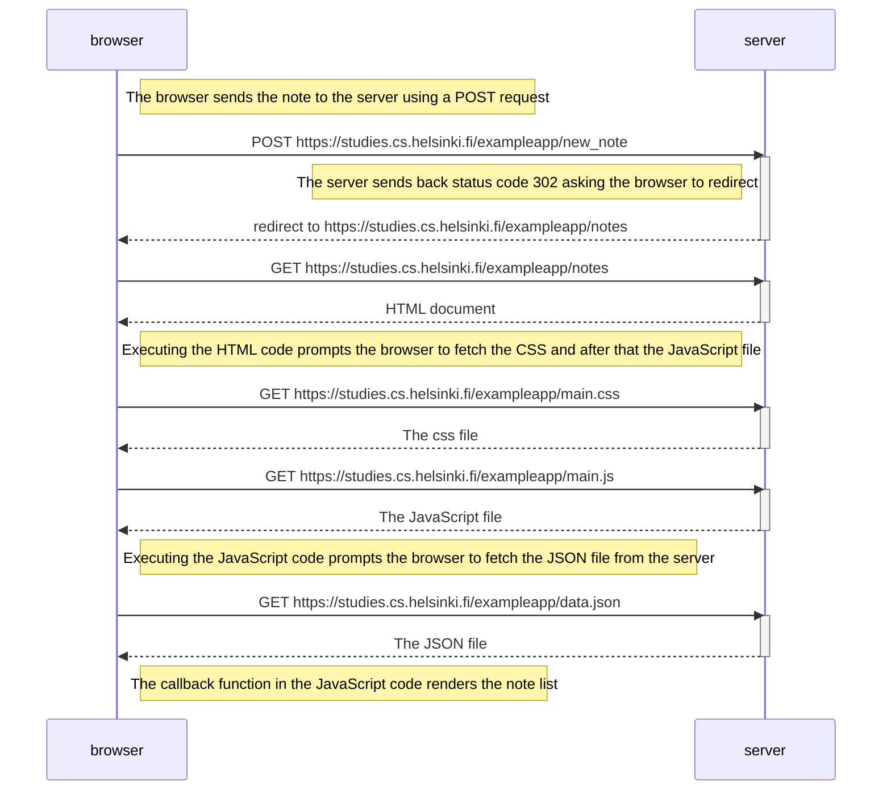

```mermaid
sequenceDiagram
    participant browser
    participant server
    
    Note right of browser: The browser sends the note to the server using a POST request

    browser->>server: POST https://studies.cs.helsinki.fi/exampleapp/new_note
    activate server
    Note left of server: The server sends back status code 302 asking the browser to redirect
    server-->>browser: redirect to https://studies.cs.helsinki.fi/exampleapp/notes
    deactivate server

    browser->>server: GET https://studies.cs.helsinki.fi/exampleapp/notes
    activate server
    server-->>browser: HTML document
    deactivate server

    Note right of browser: Executing the HTML code prompts the browser to fetch the CSS and after that the JavaScript file

    browser->>server: GET https://studies.cs.helsinki.fi/exampleapp/main.css
    activate server
    server-->>browser: The css file
    deactivate server
    
    browser->>server: GET https://studies.cs.helsinki.fi/exampleapp/main.js
    activate server
    server-->>browser: The JavaScript file
    deactivate server
    
    Note right of browser: Executing the JavaScript code prompts the browser to fetch the JSON file from the server
    
    browser->>server: GET https://studies.cs.helsinki.fi/exampleapp/data.json
    activate server
    server-->>browser: The JSON file
    deactivate server    

    Note right of browser: The callback function in the JavaScript code renders the note list
```
