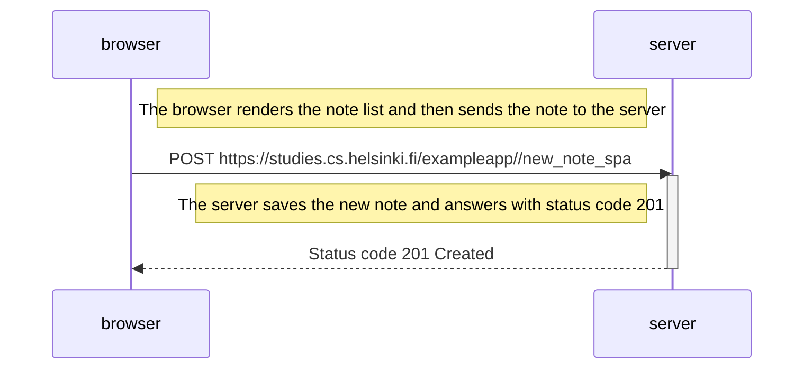

```mermaid
sequenceDiagram
    participant browser
    participant server

    Note right of browser: The browser renders the note list and then sends the note to the server

    browser->>server: POST https://studies.cs.helsinki.fi/exampleapp//new_note_spa
    activate server

    Note left of server: The server saves the new note and answers with status code 201

    server-->>browser: Status code 201 Created
    deactivate server
```
